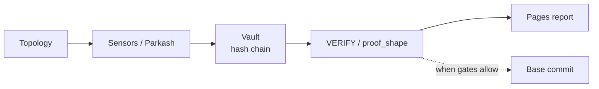

# Eigenstate Research

[](https://github.com/Kaydeep0/eigenstate-research/actions/workflows/ci.yml)
[](https://github.com/Kaydeep0/eigenstate-research/actions/workflows/deploy.yml)
[](#status-limits-and-non-goals)

[**Site**](https://kaydeep0.github.io/eigenstate-research/) · [**Methodology**](METHODOLOGY.md) · [**Verify walkthrough**](https://kaydeep0.github.io/eigenstate-research/verify-walkthrough/) · [**Ledgers**](#measured-ledgers) · [**Agent index**](https://geniusflow-federation.vercel.app/llms.txt)

Independent measurement of tokenized fixed-income and RWA settlement structure. Observe, measure,
verify, publish. This repo is the public face: reports, dossier mirrors, measured ledgers, MCP
source, and provenance. The runtime engine is private.

**For engineers and analysts who need a claim they can overturn**, not a dashboard they have to
trust. Every published rate has a machine-readable ledger behind it, every refusal names the limb
that failed, and the verifier fails closed on invented attestations.

One command, no install, no account:

```bash
curl -sS -G 'https://geniusflow-federation.vercel.app/api/verify' \
  --data-urlencode 'source_url=https://docs.aave.com/developers/aave-v3/overview' \
  --data-urlencode 'expected=v3'
```

Returns `status: "ATTESTED-PRIMARY"`, `found: true`, `proof_shape.admitted: true`. Change
`expected` to a string the source does not contain and the same endpoint refuses by name. The
difference between those two responses is the whole thesis.

## Contents

1. [Quick start](#quick-start)
2. [What it measures](#what-it-measures)
3. [How it works](#how-it-works)
4. [Measured ledgers](#measured-ledgers)
5. [Public surfaces](#public-surfaces)
6. [Who it is for](#who-it-is-for)
7. [Status, limits, and non-goals](#status-limits-and-non-goals)
8. [Operating this repo](#operating-this-repo)
9. [Documentation and evidence index](#documentation-and-evidence-index)
10. [Contact](#contact)
11. [Appendix A: agent surfaces](#appendix-a-agent-surfaces)
12. [Appendix B: Host operational log](#appendix-b-host-operational-log)

## Quick start

### Admit and refuse in 60 seconds

The command at the top of this file is the admit case. Here is the same endpoint refusing, with
one argument changed:

```bash
curl -sS -G 'https://geniusflow-federation.vercel.app/api/verify' \
  --data-urlencode 'source_url=https://docs.aave.com/developers/aave-v3/overview' \
  --data-urlencode 'expected=not-in-this-page'
```

| Response field | Admit (`expected=v3`) | Refuse (`expected=not-in-this-page`) |
|----------------|-----------------------|--------------------------------------|
| `status` | `ATTESTED-PRIMARY` | `HALLUCINATED` |
| `found` | `true` | `false` |
| `note` | `expected_found_in_source_body` | `expected_not_found_in_source_body` |
| `proof_shape.admitted` | `true` | `false` |
| `proof_shape.failed_limbs` | `[]` | `["refuse_or_admit"]` |
| `proof_shape.refuse_limb` | `null` | `refuse_or_admit` |

Both calls return HTTP 200. The refusal lives in the JSON body, not in the status code, because a
consumer that only checks status codes would read a refusal as a pass. Pipe through `jq` if you
have it.

The full six-step walkthrough (status, dossier, `/api/package` admit, `/api/package` refuse,
grounding verify, return-wire ack) is at
[verify-walkthrough/](https://kaydeep0.github.io/eigenstate-research/verify-walkthrough/).

### Run the demo in 5 minutes

A toy stack, not the private engine. Python 3.8 or newer, no API keys, no accounts.

From a clone of this repo:

```bash
python3 -m venv .venv && . .venv/bin/activate
pip install helixhash
python3 public/demo/eigenstate_demo.py
```

Without cloning, in any empty directory:

```bash
python3 -m venv .venv && . .venv/bin/activate
pip install helixhash
curl -sO https://kaydeep0.github.io/eigenstate-research/demo/eigenstate_demo.py
python3 eigenstate_demo.py
```

The venv is what makes `pip install` work on a stock macOS or Debian box, where a system-wide
`pip install` is refused as an externally managed environment. Only `helixhash` is needed; the
script uses the standard library for everything else.

**macOS cold start.** If your default `python3` is Homebrew's 3.14, the venv above can die at
`pip` import time before it installs anything. Pin the interpreter instead:

```bash
python3.12 -m venv .venv && source .venv/bin/activate
pip install helixhash
python3 public/demo/eigenstate_demo.py
```

The demo itself is fine on 3.12. If you would rather repair the 3.14 toolchain than pin around it,
`brew reinstall expat python@3.14` is the fix.

<details>
<summary>The exact error, if you want to confirm that is what you hit</summary>

On macOS, a Homebrew Python whose `libexpat` has drifted from the interpreter fails at import
time, before any of this code runs:

```
ImportError: dlopen(.../pyexpat.cpython-314-darwin.so): Symbol not found:
_XML_SetAllocTrackerActivationThreshold
```

That is a broken local toolchain, not a problem with the demo. Either pin the venv to a
known-good interpreter, `python3.12 -m venv .venv`, or repair the Homebrew one with
`brew reinstall expat python@3.14`. The demo is verified against CPython 3.12 with `helixhash`
0.1.1 from PyPI.

</details>

**What the demo does.** It reads three public series (FRED SOFR, DeFiLlama BUIDL TVL, GitHub
stars), measures each as `delta_I = |log2(current / prior)|`, crosses them into a local HelixHash
chain, then tampers with one entry in-process so you watch `verify()` flip to `False` and back. It
ends on the latest Base commit in the bundled index. If a source is unreachable the run still
completes on pinned fallback values and labels each observation as live or fallback. The demo is
not production cadence, full topology coverage, or continuous on-chain commits.

HelixHash is the underlying primitive and is separately published:
[Kaydeep0/helixhash](https://github.com/Kaydeep0/helixhash) · [HELIXHASH.md](HELIXHASH.md).

## What it measures

Tokenized funds, stablecoin rails, and on-chain settlement look transparent at the surface. The
hard parts stay opaque: who can settle, under what clock, against which benchmark, with what
custody and regulatory path.

Markets price the product. Few parties systematically measure the **structure underneath**: the
obligations, permissions, and dependencies that decide whether settlement actually works.
Eigenstate is a research measurement stack for that structure. It does **not** predict prices or
trade markets.

| Step | What happens |
|------|--------------|
| **Observe** | Watch a fixed map of institutions and rails that matter for tokenized fixed income |
| **Measure** | Score how much *new* information each entity produces relative to watch cost |
| **Verify** | Fact-check and admit or refuse claims before they are treated as published |
| **Publish** | Ship human reports on Pages; commit attestations on Base when gates allow |



Base attestation is gated, not per cycle. Depth and caveats: [METHODOLOGY.md](METHODOLOGY.md).

### E = ΔI / A

Information efficiency: new information gained (**ΔI**) over observation cost (**A**). A
structural metric, not a forecast.

*Example.* On an SEC filing day, a new rulemaking document against the prior expected state gives
high **E**. The same feed on a quiet day gives low **E**.

## How it works

Four mechanisms, each with a public artifact you can open.

### Vault

Qualifying observations append to a hash-chained measurement log (ΔI / E plus integrity fields).
Entity field numbers **Φ_S** and **κ** (not **Γ**) are mirrored on public dossiers. Changing an
old vault row breaks later hashes and parent checks.

*Example.* After a qualifying read of CIRCLE or BLACKROCK, the private vault appends a chained
row and the dossiers expose live Φ_S / κ. Public mirrors:
[CIRCLE](https://kaydeep0.github.io/eigenstate-research/federation/dossier/CIRCLE.json) ·
[BLACKROCK](https://kaydeep0.github.io/eigenstate-research/federation/dossier/BLACKROCK.json).
Not every vault row becomes a report.

### Helix commit and on-chain attestation

Local chaining is continuous. On-chain commits to `GeniusFlowSettlement` on Base land when
wallet, balance, and mirror gates pass. Attested when it lands, not every cycle.

*Example.* Historical commits:
[On-Chain Proof Index](https://kaydeep0.github.io/eigenstate-research/onchain/) (machine readable:
[`/api/onchain.json`](https://kaydeep0.github.io/eigenstate-research/api/onchain.json)). Sample
tx: [0x5a132a48…77a66](https://basescan.org/tx/0x5a132a48097c67063afcee39f3d06ee3f35166570b4eefcc18eefaa54d877a66).
Prefer the index over any single hard-coded hash.

### Verification rails

Dispatch fact-check, then VERIFY / `status_at_publish`, then federation proof_shape admit or
refuse. Cheap copies that invent "attested" labels fail.

*Example.* A package with a real registry reference and a provenance spine can **admit**. One
that stamps ATTESTED without that spine **refuses**. Spec:
[ATTESTATION_PROOF_SHAPE.md](https://geniusflow-federation.vercel.app/docs/ATTESTATION_PROOF_SHAPE.md).

### Structural gap detection

We look for what the topology *needs* that product design still treats as optional.

*Example.* SOFR plus ISDA fallback is often treated as a full LIBOR replacement. The stack still
scores a persistent term-structure gap (`LIBOR_EQUIVALENT`). See
[predictions/](https://kaydeep0.github.io/eigenstate-research/predictions/).

## Measured ledgers

Three probes that measure a rate instead of asserting one. Each names the limb that failed on
every refusal, runs its limbs in a frozen order so the counts partition rather than double-count,
and serves a per-subject receipt so a disagreement is a fetch rather than an argument.

| Ledger | Population | Headline | Why it is checkable | Machine readable |
|--------|-----------|----------|---------------------|------------------|
| [ERC-8004 refusal](https://kaydeep0.github.io/eigenstate-research/erc8004/) | 500 agentIds drawn uniformly from the 60444 registered on Base at block 49425346 | **73.0%** refuse at least one MUST limb (95% CI 68.9 to 76.7); **91.0%** including self-reference and endpoint liveness (CI 88.2 to 93.2) | the draw is seeded by the pinned block hash and nothing else, so a third party can redraw the same 500 | [`summary.json`](https://kaydeep0.github.io/eigenstate-research/erc8004/summary.json) · [`ledger.json`](https://kaydeep0.github.io/eigenstate-research/erc8004/ledger.json) |
| [Supply chain provenance](https://kaydeep0.github.io/eigenstate-research/slsa/) | census, not sample: all 94 distributions pip resolves for this engine's own `requirements.txt` | **44** serve a PEP 740 attestation and all 44 verify; **50** serve none; **0** carry SLSA build provenance | expectations committed before the run: [`expectations.json`](https://kaydeep0.github.io/eigenstate-research/slsa/expectations.json) | [`summary.json`](https://kaydeep0.github.io/eigenstate-research/slsa/summary.json) · [`ledger.json`](https://kaydeep0.github.io/eigenstate-research/slsa/ledger.json) |
| [RWA disclosure interface](https://kaydeep0.github.io/eigenstate-research/rwa/) | 17 tracked RWA issuers and tokenized instruments this node already publishes a dossier card for | **0 of 17** serve a machine readable disclosure surface on an origin they operate | expectations published before the run: [`expectations.json`](https://kaydeep0.github.io/eigenstate-research/rwa/expectations.json) | [`summary.json`](https://kaydeep0.github.io/eigenstate-research/rwa/summary.json) · [`ledger.json`](https://kaydeep0.github.io/eigenstate-research/rwa/ledger.json) |

Per-subject receipts are served from the federation origin:
[`/erc8004/receipts/<agentId>.json`](https://geniusflow-federation.vercel.app/erc8004/receipts/13.json) ·
[`/slsa/receipts/<normalized-name>.json`](https://geniusflow-federation.vercel.app/slsa/receipts/anthropic.json) ·
[`/rwa/receipts/<ENTITY>.json`](https://geniusflow-federation.vercel.app/rwa/receipts/BLACKROCK_BUIDL.json).

<details>
<summary><strong>ERC-8004: what the 73 percent is made of, and what it is not</strong></summary>

The miss rate is measured, not asserted. Of 500 agentIds drawn uniformly from the 60444 registered
on Base at block 49425346, **365 refuse at least one limb the ERC states as MUST** (73.0 percent,
95 percent CI 68.9 to 76.7), and **455 refuse** once self-reference and endpoint liveness are
counted (91.0 percent, CI 88.2 to 93.2). The largest single cause is an on-chain identity carrying
no agentURI at all, **174 of 500**. Every refusal names its limb, and limbs run in a frozen order,
so the counts partition the sample rather than double-counting it. Cite that interval or nothing.

This is not the first measurement of ERC-8004 registration quality and does not claim to be.
Xiong et al., [Can Trustless Agents Be Trusted?](https://arxiv.org/abs/2606.26028)
(arXiv 2606.26028), and Mafrur and Khusumanegara,
[From Agent Identity to Agent Economy](https://arxiv.org/abs/2606.12128) (arXiv 2606.12128), reach
the same shape from full population crawls: registration heavy, operationally shallow. Two methods
and two samples months apart landing in the same place is the useful part; the agreement is the
result, not the novelty. What this adds is operational. The sample is redrawable by a third party
because the seed is the pinned block hash and nothing else, every rate carries a Wilson interval,
and every sampled agentId has a receipt carrying the exact HTTP status or transport error.

Read it: [/erc8004/](https://kaydeep0.github.io/eigenstate-research/erc8004/).

</details>

<details>
<summary><strong>Supply chain provenance: a census of this engine's own dependencies</strong></summary>

A census, not a sample: all **94** distributions pip resolves for this engine's `requirements.txt`.
**44** serve a PEP 740 attestation and all 44 verify against Fulcio and Rekor with a digest
computed from downloaded bytes. **50** serve none. **0** carry SLSA build provenance, because every
attestation in the set is a PyPI publish attestation, which binds an upload to a workflow and does
not describe the build.

The expectations file was committed before the run
([`/slsa/expectations.json`](https://kaydeep0.github.io/eigenstate-research/slsa/expectations.json)),
and the probe refuses its own author first: two host-published roots are declared at versions the
public index cannot satisfy. These counts describe one dependency set and are **not** a PyPI-wide
rate.

Read it: [/slsa/](https://kaydeep0.github.io/eigenstate-research/slsa/).

</details>

<details>
<summary><strong>RWA disclosure: measured as an interface, not as a document</strong></summary>

Seventeen real world asset issuers and tokenized instruments that this node already publishes a
dossier card for, asked one question: can a program read the disclosed figure without a human, a
document parser, or a third party who already did both.

- **0 of 17** serve a machine readable disclosure surface on an origin they operate.
- **2 of 17** have a machine readable surface recorded at all (**2 of the 15** recorded surfaces
  serve structured bytes; the other 13 are HTML documents), and both belong to the same third
  party aggregator. That is why this engine's own reserve figures for BUIDL and OUSG come from
  DefiLlama rather than from BlackRock, Securitize or Ondo.
- **0 of 45** requests to a frozen list of conventional disclosure paths answered with structured
  bytes, because no such convention exists to follow.
- **0 of 15** recorded surfaces carry a chain qualified registry reference, so no disclosure here
  identifies a single deployment without the reader guessing the network.

Expectations were published in an earlier commit
([`/rwa/expectations.json`](https://kaydeep0.github.io/eigenstate-research/rwa/expectations.json)),
and the survey publishes two defects it found in its own probe. This is **not** a measure of
disclosure quality and **not** a sector rate: the population is what this node tracks, and eleven
of the seventeen refuse at the first limb on this node's own missing coverage. For the
issuer-attributable figure, cite `attributable_to_issuer` (6 in scope, 2 admit, 4 refuse).

Read it: [/rwa/](https://kaydeep0.github.io/eigenstate-research/rwa/).

</details>

## Public surfaces

| Surface | Role |
|---------|------|
| [GitHub Pages](https://kaydeep0.github.io/eigenstate-research/) | Human research site (canonical website) |
| [This repo](https://github.com/Kaydeep0/eigenstate-research) | Public GitHub face: reports, static federation mirrors, MCP source, provenance |
| [Federation (Vercel)](https://geniusflow-federation.vercel.app/) | Live verify wire, OpenAPI, MCP `/api/mcp`, A2A card, ERC-8004 domain proof |
| [helixhash](https://github.com/Kaydeep0/helixhash) · [witnessfield](https://github.com/Kaydeep0/witnessfield) | Public integrity and evidence libraries |
| `geniusflow-engine` | **Private** runtime. Not cloneable without access. |

### Recent public UX (Aug 2026)

- **Entity hubs** under `/reports/<entity>/`, with publish-time Φ_S / κ evolution and a series
  timeline
- **Signal Reports index** grouped by entity, with expandable dated timelines
- **Track Record** is a falsifiable Host claim register, not a marketing accuracy percentage;
  **Predictions** covers open structural gaps
- **Provenance:** OpenTimestamps commitment over the helix head (Bitcoin-attested, block
  **960660**) plus a Software Heritage archival request pointer
- **MCP public source:** [`mcp/`](mcp/) in this repo; live remote at federation `/api/mcp` and
  `/server.json`

## Who it is for

Outsider-facing and grounded in what the public stack actually ships today. Every row names what
it is not, because that is the part most projects leave out.

| Use case | Who | Today without this | What this gives you | Explicitly not |
|----------|-----|--------------------|---------------------|----------------|
| **RWA and governance diligence** | Allocator, compliance, or RWA-desk analysts reviewing tokenized fixed income issuers and rails | Manual scrapes of issuer sites, filings, and press; no shared admit or refuse check on "attested" packages | Public dossiers and signal reports; federation `/api/verify` and `/api/package` against registry and proof_shape; `status_at_publish` on published claims | Bank settlement, custody, KYC, or a paid diligence SLA |
| **Structural gap tracking** | Rates and structure research desks watching benchmark and settlement fragility | Ad hoc SOFR and LIBOR notes; product marketing treated as a full replacement | Persistent gap framing (`LIBOR_EQUIVALENT`) on the [predictions](https://kaydeep0.github.io/eigenstate-research/predictions/) page, tied to the fixed M1 topology | Price forecasts, trade signals, or a claim that publishing a SOFR article "closes" the gap |
| **Agent tooling for attested claims** *(secondary)* | Builders and agents that need machine-readable claim surfaces | Scrape HTML; invent "attested" labels with no refuse limb | Federation [llms.txt](https://geniusflow-federation.vercel.app/llms.txt), OpenAPI, `/api/manifest`, `/api/verify`, `/api/package`, proof_shape admit and refuse, MCP adapter docs | Guaranteed uptime or a commercial agent SLA (`/api/status` is best-effort Vercel) |
| **Internal measurement and audit trail** | Host and internal research ops running the private engine | Scattered logs with no public mirror path | Cycle vault hash-chain for measure; Helix commits to `GeniusFlowSettlement` on Base when wallet, balance, and mirror gates allow; Proof Index for historical transactions | Every parkash cycle on-chain, or a retail settlement product for banks |

## Status, limits, and non-goals

**Research, pre-revenue.** Public artifacts are real (reports, dossiers, Basescan commits when
published). There is no claimed customer book, bank partnership, or production settlement product
on this face. Coverage and on-chain mirror paths are partial by design; see
[METHODOLOGY.md](METHODOLOGY.md) for what is live versus gated.

### Non-goals

| Not this | Why |
|----------|-----|
| Price prediction or trade signals | The metric is structural. `E = ΔI / A` scores information, not direction. |
| An on-chain commit every cycle | Helix attestation is gated on wallet, balance, and mirror checks. Local chaining is continuous; the commit is not. |
| A production settlement, custody, or KYC product | Nothing here settles value for a third party. |
| A commercial SLA | `/api/status` is best-effort Vercel. There is no uptime guarantee. |
| Sector-wide rates from the measured ledgers | Each ledger states its own population. The RWA survey covers what this node tracks; the provenance census covers one dependency set. |
| A cold start from a clone of the engine | The runtime is private. Machine cold start is the federation, see [Appendix A](#appendix-a-agent-surfaces). |

### Source of truth

The source of truth for Host and Pages field tiles is the GeniusFlow engine measurement state:
`workspace/HOST/state.json` (κ, Protocol Truth, parkash stamps) plus the M1 coverage ledger
(`m1_strict` ∩ topology / **199**). The site bakes a stamp into
[`public/field-state.json`](public/field-state.json); homepage proof tiles and `/track-record` read
that stamp at build time and again at runtime from the same origin. This is not frozen marketing
HTML.

Report heroes overlay live Φ_S / κ from dossier mirrors when present, while the prose stays a dated
snapshot. Signal report green badges are **vault@publish** (trimmed cycle-vault rows), not M1
lifetime observations.

CI fails the build on hardcoded stale denominators (196 or 197) or fake 100 percent accuracy
marketing in Astro sources: [`scripts/check-sot-honesty.sh`](scripts/check-sot-honesty.sh).

## Operating this repo

Host-only. After a parkash, refresh the public surfaces from the engine. Do not hand-edit proof
tiles.

```bash
# Machine with private engine clone + Vercel auth for federation:
export GENIUSFLOW_ROOT=~/Desktop/GENIUSFLOW_OS/workspace/geniusflow   # or your path
export GENIUSFLOW_BUILDER_DEPLOY=1
export EIGENSTATE_SITE_ROOT=/path/to/eigenstate-research              # optional; auto-detected

./scripts/refresh-public.sh
# writes public/field-state.json
# writes public/federation/dossier/*.json (+ repo-root federation/ mirror)
# rebakes and deploys federation on Vercel when GENIUSFLOW_BUILDER_DEPLOY=1

git add public/field-state.json public/federation federation public/AGENTS.md public/METHODOLOGY.md
git commit -m "Refresh public SoT + dossier mirrors after parkash."
git push   # GitHub Pages deploy workflow
```

Engine equivalent:

```bash
PYTHONPATH=engine python3 engine/tools/refresh_public_surfaces.py --site /path/to/eigenstate-research
```

## Documentation and evidence index

| Topic | Where |
|-------|-------|
| Methodology, full depth | [METHODOLOGY.md](METHODOLOGY.md) (core equation, vault, helix commit, verification, topology, gap detector, numbers glossary) |
| HelixHash primitive | [HELIXHASH.md](HELIXHASH.md) · [Kaydeep0/helixhash](https://github.com/Kaydeep0/helixhash) |
| Verify walkthrough, copy-paste | [verify-walkthrough/](https://kaydeep0.github.io/eigenstate-research/verify-walkthrough/) (status, dossier, package and verify for `AAVE_V3`) |
| Signal reports | [reports/](https://kaydeep0.github.io/eigenstate-research/reports/), entity-grouped with expandable timelines, plus [entity hubs](https://kaydeep0.github.io/eigenstate-research/reports/circle/) carrying publish-time Φ_S / κ |
| Track record and open predictions | [track-record/](https://kaydeep0.github.io/eigenstate-research/track-record/) · [predictions/](https://kaydeep0.github.io/eigenstate-research/predictions/) |
| On-chain proof index | [onchain/](https://kaydeep0.github.io/eigenstate-research/onchain/) · [`api/onchain.json`](https://kaydeep0.github.io/eigenstate-research/api/onchain.json) |
| Provenance (OpenTimestamps + Software Heritage pointer) | [provenance/](https://kaydeep0.github.io/eigenstate-research/provenance/) · [OTS commitment file](https://kaydeep0.github.io/eigenstate-research/provenance/opentimestamps/helix-head-917f0e3036931e14.txt) |
| Measured ledgers | [erc8004/](https://kaydeep0.github.io/eigenstate-research/erc8004/) · [slsa/](https://kaydeep0.github.io/eigenstate-research/slsa/) · [rwa/](https://kaydeep0.github.io/eigenstate-research/rwa/) |
| Federation verify wire | [geniusflow-federation.vercel.app](https://geniusflow-federation.vercel.app/) with `/api/manifest`, `/api/chain`, `/api/verify`, `/api/package` |
| Agent cold start | [`AGENTS.md`](AGENTS.md) · [Appendix A](#appendix-a-agent-surfaces) |

## Contact

- Paragraph: [paragraph.com/@eigenstate](https://paragraph.com/@eigenstate)
- GitHub: [Kaydeep0/eigenstate-research](https://github.com/Kaydeep0/eigenstate-research)
- Site: [kaydeep0.github.io/eigenstate-research](https://kaydeep0.github.io/eigenstate-research/)
- Access requests: [request-access/](https://kaydeep0.github.io/eigenstate-research/request-access/)

Issues and corrections on this repo are welcome. If you can show a receipt that contradicts a
published number, that is the most useful thing you can send.

## Appendix A: agent surfaces

Pages stays the human website. Machine cold start is the federation, not this README and not a
clone of the private engine.

**Canonical start:** <https://geniusflow-federation.vercel.app/llms.txt>

Traverse: hub, then status, then dossier, then `/api/package` or `/api/verify` (proof_shape admit
or refuse), then optionally `/api/return_wire`, then the canonical report on Pages. Human version
of the same path: [verify-walkthrough/](https://kaydeep0.github.io/eigenstate-research/verify-walkthrough/).

### Core

| Surface | URL |
|---------|-----|
| Agent index (`llms.txt`) | <https://geniusflow-federation.vercel.app/llms.txt> |
| OpenAPI 3 | <https://geniusflow-federation.vercel.app/openapi.json> |
| Status and SLA tier | <https://geniusflow-federation.vercel.app/api/status> |
| Attestation proof shape | <https://geniusflow-federation.vercel.app/docs/ATTESTATION_PROOF_SHAPE.md> |
| Tool adapter and MCP guide | <https://geniusflow-federation.vercel.app/docs/AGENT_TOOL_ADAPTER.md> |
| Verify walkthrough (human plus curl) | <https://kaydeep0.github.io/eigenstate-research/verify-walkthrough/> |
| Pages `llms.txt` (pointer) | <https://kaydeep0.github.io/eigenstate-research/llms.txt> |
| In-repo pointer | [`AGENTS.md`](AGENTS.md) |

### Network membership

| Surface | URL |
|---------|-----|
| MCP remote (JSON-RPC over POST; a browser GET returns 405 by design) | <https://geniusflow-federation.vercel.app/api/mcp> |
| MCP registry declaration | <https://geniusflow-federation.vercel.app/server.json> |
| MCP registry entry (live lookup) | <https://registry.modelcontextprotocol.io/v0/servers?search=geniusflow> |
| MCP public source (this repo) | <https://github.com/Kaydeep0/eigenstate-research/tree/main/mcp> |
| A2A agent card | <https://geniusflow-federation.vercel.app/.well-known/agent-card.json> |
| A2A JSON-RPC | <https://geniusflow-federation.vercel.app/api/a2a> |
| ERC-8004 domain proof (`registrations` is empty on purpose: a named refusal, no agentId claimed) | <https://geniusflow-federation.vercel.app/.well-known/agent-registration.json> |

### Measured ledgers, machine readable

| Ledger | Human | Machine | Per-subject receipt (federation origin only) |
|--------|-------|---------|----------------------------------------------|
| ERC-8004 refusal (Base, read-only probe) | [/erc8004/](https://kaydeep0.github.io/eigenstate-research/erc8004/) | `/erc8004/summary.json` and `/erc8004/ledger.json` on both origins | `https://geniusflow-federation.vercel.app/erc8004/receipts/<agentId>.json` (worked example: [agent 13](https://geniusflow-federation.vercel.app/erc8004/receipts/13.json)) |
| Provenance census (this engine's own dependencies, PEP 740 and SLSA) | [/slsa/](https://kaydeep0.github.io/eigenstate-research/slsa/) | `/slsa/expectations.json` (published before the run), `/slsa/summary.json`, `/slsa/ledger.json` on both origins | `https://geniusflow-federation.vercel.app/slsa/receipts/<normalized-name>.json` (worked example: [anthropic](https://geniusflow-federation.vercel.app/slsa/receipts/anthropic.json)) |
| RWA disclosure interface survey (17 tracked issuers, machine readable or not) | [/rwa/](https://kaydeep0.github.io/eigenstate-research/rwa/) | `/rwa/expectations.json` (published before the run), `/rwa/summary.json`, `/rwa/ledger.json` on both origins | `https://geniusflow-federation.vercel.app/rwa/receipts/<ENTITY>.json` (worked example: [BLACKROCK_BUIDL](https://geniusflow-federation.vercel.app/rwa/receipts/BLACKROCK_BUIDL.json)) |

Headline numbers, intervals, and the caveats that must travel with them are in
[Measured ledgers](#measured-ledgers). Do not quote a rate without the population it was measured
over.

### Provenance

| Surface | URL |
|---------|-----|
| Provenance page (human) | <https://kaydeep0.github.io/eigenstate-research/provenance/> |
| OpenTimestamps commitment over the helix head (Bitcoin block 960660) | <https://kaydeep0.github.io/eigenstate-research/provenance/opentimestamps/helix-head-917f0e3036931e14.txt> |
| Software Heritage identifiers (SWHID) | federation [`/api/agent`](https://geniusflow-federation.vercel.app/api/agent), field `provenance.software_identifiers` |
| On-chain proof index, machine readable | <https://kaydeep0.github.io/eigenstate-research/api/onchain.json> |

## Appendix B: Host operational log

**2026-08-01/02.** MCP registry published `io.github.Kaydeep0/geniusflow-federation` **1.0.0**
(a duplicate-version re-publish is expected to be refused). OTS helix-head verified via
lite-client at Bitcoin block **960660** (proof:
`public/provenance/opentimestamps/helix-head-917f0e3036931e14.txt.ots`). A2A day-5 probe-receipt
comments posted.
