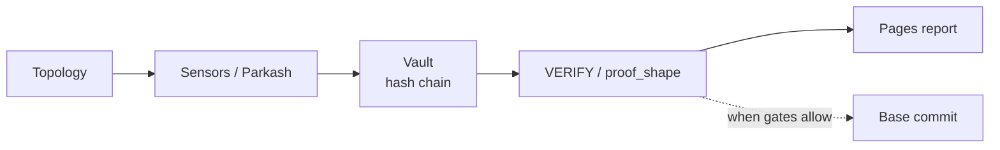

# Eigenstate Research

Independent measurement of tokenized fixed-income and RWA settlement — observe, measure, verify, publish.

**Site:** [kaydeep0.github.io/eigenstate-research](https://kaydeep0.github.io/eigenstate-research/)

---

## The problem

Tokenized funds, stablecoin rails, and on-chain settlement look transparent at the surface. The hard parts — who can settle, under what clock, against which benchmark, with what custody and regulatory path — stay opaque.

Markets price the product. Few parties systematically measure the **structure underneath**: the obligations, permissions, and dependencies that decide whether settlement actually works.

---

## What Eigenstate does

Eigenstate is a research measurement stack for that structure. It does **not** predict prices or trade markets.

| Step | Meaning |
|------|---------|
| **Observe** | Watch a fixed map of institutions and rails that matter for tokenized FI |
| **Measure** | Score how much *new* information each entity produces relative to watch cost |
| **Verify** | Fact-check and admit/refuse claims before they are treated as published |
| **Publish** | Ship human reports on Pages; commit attestations on Base when gates allow |

Public output lives here (reports, dossiers, proof index). The runtime engine stays private.

---

## How it works

Short version. Depth and caveats: [METHODOLOGY.md](METHODOLOGY.md).



*Observe → measure → verify → publish; Base attest is gated. Structural metric, not a price forecast. Helix / on-chain commit is not every cycle.*

### E = ΔI / A

Information efficiency: new information gained (**ΔI**) over observation cost (**A**). Structural metric, not a forecast.

*Example.* On an SEC filing day, a new rulemaking document against the prior expected state → high **E**. Same feed on a quiet day → low **E**.

### Vault

Qualifying observations append to a hash-chained measurement log (ΔI / E + integrity fields). Entity field numbers **Φ_S** / **κ** (not **Γ**) are mirrored on public dossiers. Changing an old vault row breaks later hashes / parent checks.

*Example.* After a qualifying read of CIRCLE or BLACKROCK, the private vault appends a chained row; dossiers expose live Φ_S / κ. Public mirrors: [CIRCLE](https://kaydeep0.github.io/eigenstate-research/federation/dossier/CIRCLE.json), [BLACKROCK](https://kaydeep0.github.io/eigenstate-research/federation/dossier/BLACKROCK.json). Not every vault row becomes a report.

### Helix / attestation (when published)

Local chaining is continuous. On-chain commits to Base land when wallet, balance, and mirror gates pass — **attested when it lands**, not every cycle.

*Example.* Historical commits: [On-Chain Proof Index](https://kaydeep0.github.io/eigenstate-research/onchain/). Sample tx: [0x5a132a48…77a66](https://basescan.org/tx/0x5a132a48097c67063afcee39f3d06ee3f35166570b4eefcc18eefaa54d877a66). Prefer the index over any single hard-coded hash.

### Verification rails

Dispatch fact-check → VERIFY / `status_at_publish` → federation proof_shape admit/refuse. Cheap copies that invent “attested” labels fail.

*Example.* A package with a real registry reference and provenance spine can **admit**. One that stamps ATTESTED without that spine **refuses**. Spec: [ATTESTATION_PROOF_SHAPE.md](https://geniusflow-federation.vercel.app/docs/ATTESTATION_PROOF_SHAPE.md).

### Structural gaps

We look for what the topology *needs* that product design still treats as optional.

*Example.* SOFR + ISDA fallback is often treated as a full LIBOR replacement; the stack still scores a persistent term-structure gap (`LIBOR_EQUIVALENT`). See [predictions](https://kaydeep0.github.io/eigenstate-research/predictions/).

---

## Use cases

Honest, outsider-facing. Grounded in what the public stack actually ships today.

### RWA / governance diligence

| | |
|--|--|
| **Who** | Allocator, compliance, or RWA-desk analysts reviewing tokenized FI issuers and rails |
| **Today without this** | Manual scrapes of issuer sites, filings, and press; no shared admit/refuse check on “attested” packages |
| **Eigenstate offers** | Public dossiers + signal reports; federation `/api/verify` and `/api/package` against registry / proof_shape; `status_at_publish` on published claims |
| **Not** | Bank settlement, custody, KYC, or a paid diligence SLA |

### Research desk — structural gap tracking

| | |
|--|--|
| **Who** | Rates / structure research desks watching benchmark and settlement fragility |
| **Today without this** | Ad hoc SOFR/LIBOR notes; product marketing treated as full replacement |
| **Eigenstate offers** | Persistent gap framing (`LIBOR_EQUIVALENT`) on the [predictions](https://kaydeep0.github.io/eigenstate-research/predictions/) page, tied to the fixed M1 topology |
| **Not** | Price forecasts, trade signals, or a claim that publishing a SOFR article “closes” the gap |

### Agent tooling for attested claims *(secondary)*

| | |
|--|--|
| **Who** | Builders and agents that need machine-readable claim surfaces |
| **Today without this** | Scrape HTML; invent “attested” labels with no refuse limb |
| **Eigenstate offers** | Federation [llms.txt](https://geniusflow-federation.vercel.app/llms.txt), OpenAPI, `/api/manifest` · `/api/verify` · `/api/package`, proof_shape admit/refuse, MCP adapter docs |
| **Not** | Guaranteed uptime or a commercial agent SLA (`/api/status` is best-effort Vercel) |

### Internal measurement / audit trail

| | |
|--|--|
| **Who** | Host / internal research ops running the private engine |
| **Today without this** | Scattered logs with no public mirror path |
| **Eigenstate offers** | Cycle vault hash-chain for measure; Helix commits to `GeniusFlowSettlement` on Base when wallet / balance / mirror gates allow; Proof Index for historical txs |
| **Not** | Every parkash cycle on-chain; a retail “settlement product” for banks |

---

## Evidence / try it

| Path | Link |
|------|------|
| Methodology (full depth) | [METHODOLOGY.md](METHODOLOGY.md) |
| **Verify walkthrough** (copy-paste) | [verify-walkthrough/](https://kaydeep0.github.io/eigenstate-research/verify-walkthrough/) — status → dossier → package/verify for `AAVE_V3` |
| Signal reports (entity-grouped) | [reports/](https://kaydeep0.github.io/eigenstate-research/reports/) with expandable timelines + [entity hubs](https://kaydeep0.github.io/eigenstate-research/reports/circle/) with publish-time Φ_S / κ |
| Track Record / predictions | [track-record/](https://kaydeep0.github.io/eigenstate-research/track-record/) · [predictions/](https://kaydeep0.github.io/eigenstate-research/predictions/) |
| On-chain proof index | [onchain/](https://kaydeep0.github.io/eigenstate-research/onchain/) |
| Provenance (OTS + SWH pointer) | [provenance/](https://kaydeep0.github.io/eigenstate-research/provenance/) |
| Federation verify (technical) | [geniusflow-federation.vercel.app](https://geniusflow-federation.vercel.app/) → `/api/manifest`, `/api/chain`, `/api/verify`, `/api/package` |

**5-minute demo** (from this repo root; toy stack — not the private engine):

```bash
pip install helixhash requests
python3 public/demo/eigenstate_demo.py
```

HelixHash: [Kaydeep0/helixhash](https://github.com/Kaydeep0/helixhash). The script pulls a few public series, appends them into a local HelixHash chain, and points at a historical Basescan tx / Proof Index. Demo ≠ production cadence, full topology coverage, or continuous on-chain commits.

---

## Public surfaces

| Surface | Role |
|---------|------|
| [GitHub Pages](https://kaydeep0.github.io/eigenstate-research/) | Human research site (canonical website) |
| [This repo](https://github.com/Kaydeep0/eigenstate-research) | Public GitHub face: reports, static federation mirrors, MCP source, provenance |
| [Federation (Vercel)](https://geniusflow-federation.vercel.app/) | Live verify wire, OpenAPI, MCP `/api/mcp`, A2A card, ERC-8004 domain proof |
| [helixhash](https://github.com/Kaydeep0/helixhash) · [witnessfield](https://github.com/Kaydeep0/witnessfield) | Public integrity / evidence libs |
| `geniusflow-engine` | **Private** runtime; not cloneable without access |

### Recent public UX (Aug 2026)

- **Entity hubs** under `/reports/<entity>/` (publish-time Φ_S / κ evolution + series timeline)
- **Signal Reports index** grouped by entity with expandable dated timelines
- **Track Record** = falsifiable Host claim register (not marketing accuracy %); **Predictions** page for open structural gaps
- **Provenance:** OpenTimestamps commitment over helix head (Bitcoin-attested, block **960660**) + SWH archival request pointer
- **MCP public source:** [`mcp/`](mcp/) in this repo; live remote at federation `/api/mcp` + `/server.json`

---

## Status

Research / pre-revenue. Public artifacts are real (reports, dossiers, Basescan commits when published). There is no claimed customer book, bank partnership, or production settlement product on this face.

Coverage and on-chain mirror paths are partial by design — see Methodology for what is live vs gated.

**SoT (source of truth)** for Host/Pages field tiles is the GeniusFlow engine measurement state: `workspace/HOST/state.json` (κ, Protocol Truth, parkash stamps) plus the M1 coverage ledger (`m1_strict` ∩ topology / **199**). The site bakes a stamp into [`public/field-state.json`](public/field-state.json); homepage proof tiles and `/track-record` read that stamp at build time — not frozen marketing HTML.

### After parkash → refresh public surfaces (do not hand-edit tiles)

```bash
# Machine with private engine clone + Vercel auth for federation:
export GENIUSFLOW_ROOT=~/Desktop/GENIUSFLOW_OS/workspace/geniusflow   # or your path
export GENIUSFLOW_BUILDER_DEPLOY=1
export EIGENSTATE_SITE_ROOT=/path/to/eigenstate-research              # optional; auto-detected

./scripts/refresh-public.sh
# → public/field-state.json
# → public/federation/dossier/*.json (+ repo-root federation/ mirror)
# → federation Vercel rebake/deploy when GENIUSFLOW_BUILDER_DEPLOY=1

git add public/field-state.json public/federation federation public/AGENTS.md public/METHODOLOGY.md
git commit -m "Refresh public SoT + dossier mirrors after parkash."
git push   # GitHub Pages deploy workflow
```

Engine equivalent: `PYTHONPATH=engine python3 engine/tools/refresh_public_surfaces.py --site …/eigenstate-research`.

Homepage proof tiles + `/track-record` read `field-state.json` (build-time + same-origin runtime fetch). Report heroes overlay live Φ_S / κ from dossier mirrors when present; prose stays a dated snapshot. Signal report green badges are **vault@publish** (trimmed cycle-vault rows), not M1 lifetime observations.

CI fails on hardcoded stale denoms (196/197) or fake 100% accuracy marketing in Astro sources (`scripts/check-sot-honesty.sh`).

---

## Contact

- Paragraph: [paragraph.com/@eigenstate](https://paragraph.com/@eigenstate)
- GitHub: [Kaydeep0/eigenstate-research](https://github.com/Kaydeep0/eigenstate-research)
- Site: [kaydeep0.github.io/eigenstate-research](https://kaydeep0.github.io/eigenstate-research/)

---

## Appendix: For agents

Pages stays the human website. Machine cold-start is federation; not this README’s top matter, and not a clone of the private engine.

**Canonical start:** https://geniusflow-federation.vercel.app/llms.txt

| Surface | URL |
|---------|-----|
| Agent index (`llms.txt`) | https://geniusflow-federation.vercel.app/llms.txt |
| OpenAPI 3 | https://geniusflow-federation.vercel.app/openapi.json |
| Status / SLA | https://geniusflow-federation.vercel.app/api/status |
| MCP remote | https://geniusflow-federation.vercel.app/api/mcp |
| MCP registry declaration | https://geniusflow-federation.vercel.app/server.json |
| A2A agent card | https://geniusflow-federation.vercel.app/.well-known/agent-card.json |
| A2A JSON-RPC | https://geniusflow-federation.vercel.app/api/a2a |
| ERC-8004 domain proof | https://geniusflow-federation.vercel.app/.well-known/agent-registration.json |
| **ERC-8004 refusal ledger** (Base, read-only probe) | https://kaydeep0.github.io/eigenstate-research/erc8004/ |
| ERC-8004 ledger, machine readable | `/erc8004/summary.json` and `/erc8004/ledger.json` on both origins |
| ERC-8004 per-agent receipt | https://geniusflow-federation.vercel.app/erc8004/receipts/`<agentId>`.json |
| **Provenance census** (this engine's own dependencies, PEP 740 and SLSA) | https://kaydeep0.github.io/eigenstate-research/slsa/ |
| Provenance expectations, published before the run | `/slsa/expectations.json` on both origins |
| Provenance census, machine readable | `/slsa/summary.json` and `/slsa/ledger.json` on both origins |
| Provenance per-package receipt | https://geniusflow-federation.vercel.app/slsa/receipts/`<normalized-name>`.json |
| Attestation proof shape | https://geniusflow-federation.vercel.app/docs/ATTESTATION_PROOF_SHAPE.md |
| Tool adapter / MCP | https://geniusflow-federation.vercel.app/docs/AGENT_TOOL_ADAPTER.md |
| OTS commitment (file) | https://kaydeep0.github.io/eigenstate-research/provenance/opentimestamps/helix-head-917f0e3036931e14.txt |
| MCP public source (this repo) | https://github.com/Kaydeep0/eigenstate-research/tree/main/mcp |
| **Verify walkthrough** (human + curl) | https://kaydeep0.github.io/eigenstate-research/verify-walkthrough/ |
| Pages `llms.txt` (pointer) | https://kaydeep0.github.io/eigenstate-research/llms.txt |
| In-repo pointer | [`AGENTS.md`](AGENTS.md) |

Traverse: hub → status → dossier → `/api/package` / `/api/verify` (proof_shape admit/refuse) → optional `/api/return_wire` → canonical report on Pages. Walkthrough: [verify-walkthrough/](https://kaydeep0.github.io/eigenstate-research/verify-walkthrough/).

**ERC-8004 miss rate is now measured, not asserted.** 500 agentIds drawn uniformly from the
60444 registered on Base at block 49425346: 365 refuse at least one limb the ERC states as
MUST (73.0 percent, 95 percent CI 68.9 to 76.7), and 455 refuse once self-reference and
endpoint liveness are counted (91.0 percent, CI 88.2 to 93.2). The largest single cause is an
on-chain identity carrying no agentURI at all, 174 of 500. Every refusal names its limb:
[/erc8004/](https://kaydeep0.github.io/eigenstate-research/erc8004/). Cite that interval or
nothing.

**Supply chain provenance is measured on this engine's own dependencies.** A census, not a
sample: all 94 distributions pip resolves for this engine's `requirements.txt`. 44 serve a
PEP 740 attestation and all 44 verify against Fulcio and Rekor with a digest computed from
downloaded bytes. 50 serve none. 0 carry SLSA build provenance, because every attestation in
the set is a PyPI publish attestation, which binds an upload to a workflow and does not
describe the build. The expectations file was committed before the run
([/slsa/expectations.json](https://kaydeep0.github.io/eigenstate-research/slsa/expectations.json)),
and the probe refuses its own author first: two host-published roots are declared at versions
the public index cannot satisfy. Read it at
[/slsa/](https://kaydeep0.github.io/eigenstate-research/slsa/). These counts describe one
dependency set and are not a PyPI-wide rate.

**Host-done (2026-08-01/02):** MCP registry published `io.github.Kaydeep0/geniusflow-federation` **1.0.0** (duplicate-version re-publish expected/refused). OTS helix-head verified via lite-client — Bitcoin block **960660** (proof: `public/provenance/opentimestamps/helix-head-917f0e3036931e14.txt.ots`). **A2A day-5 probe-receipt comments: posted.**
